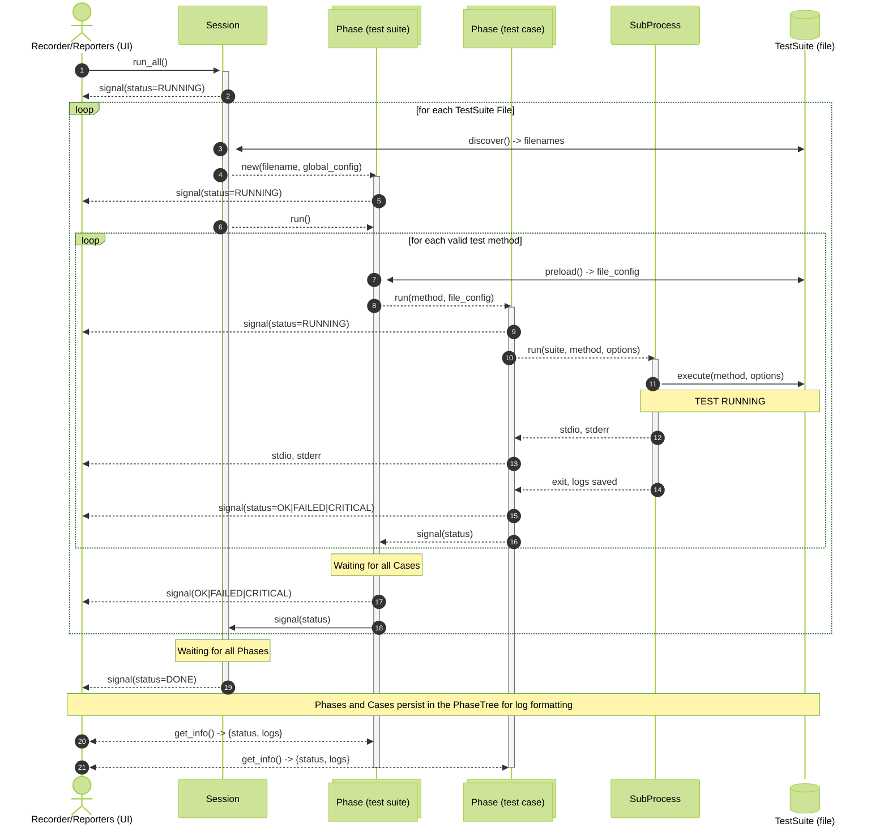

# Testiny conception

## Sequence Diagram

```mermaid
---
config:
    theme: 'forest'
---

sequenceDiagram
    autonumber
    actor Ui as Recorder/Reporters (UI)
    participant Session
    participant Phase@{ "type" : "collections" } as Phase (test suite)
    participant Case@{ "type" : "collections" } as Phase (test case)
    participant SubProcess
    participant Suite@{ "type" : "database" } as TestSuite (file)

    activate Session
    Ui->>Session: run_all()
    activate Session
    Session-->>Ui: signal(status=RUNNING) 
    loop for each TestSuite File
        Session<<->>Suite: discover() -> filenames
        Session-->>Phase: new(filename, global_config)
        activate Phase
        Phase-->>Ui: signal(status=RUNNING)
        Session-->>Phase: run()
        loop for each valid test method
            Phase<<->>Suite: preload() -> file_config
            Phase-->>Case: run(method, file_config)
            activate Case
            Case-->>Ui: signal(status=RUNNING)
            Case-->>SubProcess: run(suite, method, options)
            activate SubProcess
            SubProcess->>Suite: execute(method, options)
            note over Suite, SubProcess: TEST RUNNING
            SubProcess-->>Case: stdio, stderr
            Case-->>Ui: stdio, stderr
            SubProcess-->>Case: exit, logs saved
            deactivate SubProcess
            Case -->>Ui: signal(status=OK|FAILED|CRITICAL)
            Case-->>Phase: signal(status)
        end
        note over Phase: Waiting for all Cases
        Phase-->>Ui: signal(OK|FAILED|CRITICAL)
        Phase->>Session: signal(status)
    end
    note over Session: Waiting for all Phases
    Session-->>Ui: signal(status=DONE)
    deactivate Session
    note over Ui, Suite: Phases and Cases persist in the PhaseTree for log formatting
    Ui<<-->>Phase: get_info() -> {status, logs}
    Ui<<-->>Case: get_info() -> {status, logs}
    deactivate Case
    deactivate Phase
```

